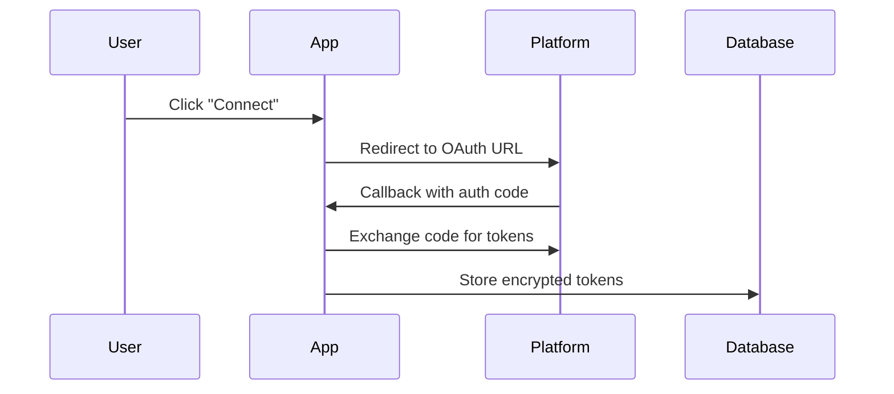
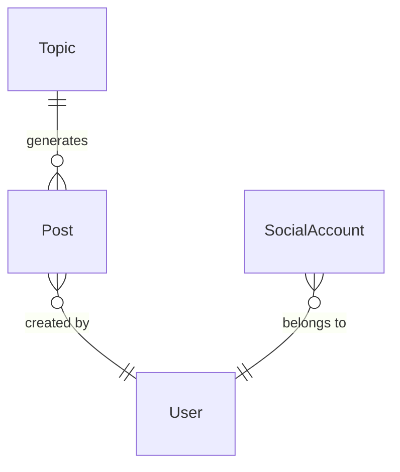

# Documentation Standards

Visual, structural, and content standards for all documentation in the AllOnFire monorepo.

## 1. File Hierarchy

| Level | Files | Purpose |
|-------|-------|---------|
| **Root** | `README.md` | Public-facing project overview, badges, screenshots, quick start |
| **Root** | `CLAUDE.md`, `.claude/CLAUDE.md` | AI assistant coding rules and conventions |
| **Package/App** | `{package}/README.md` | Package API reference, setup, usage examples |
| **Feature** | `features/{name}/README.md` | Feature overview, component hierarchy, data flow |
| **Feature** | `features/{name}/CLAUDE.md` | AI-oriented modification guide, gotchas, dependencies |
| **Guides** | `docs/{nn}-{topic}.md` | Progressive numbered guides (overview, architecture, database, deployment, dev) |

## 2. Image Formatting

Always use HTML-centered images, never raw markdown ``:

### Single Image

```html
<p align="center">
  
</p>
```

### Image Grid (3 per row)

```html
<p align="center">
  
  &nbsp;&nbsp;
  
  &nbsp;&nbsp;
  
</p>
```

### Width Guidelines

| Context | Width | Example |
|---------|-------|---------|
| Grid (3 per row) | `260` | Root README screenshot grid |
| Grid (2 per row) | `400` | Feature walkthrough |
| Standalone | `600` | Full-page screenshot |
| Logo/icon | `180` | Header logo |

Rules:
- Always include `width` attribute (prevents layout shift)
- Always include `alt` attribute (accessibility)
- Use relative paths from the file's location

## 3. Badges

Place in root README header only:

```html
<p align="center">
  
  
  
  
  
  
</p>
```

## 4. Heading Emoji

Use sparingly in root README only for scanability:

```markdown
## What is AllOnFire?
## Packages
## Quick Start
## Architecture
## Project Structure
## Documentation
```

Do NOT use emoji in package/feature docs — keep those clean and technical.

## 5. Diagram Standards

### Core Rules

1. **Max 5-7 nodes per diagram** — if more needed, split into multiple
2. **One diagram per flow** — never combine happy path, error path, alt flow
3. **Full descriptive labels** — no abbreviations (CG, SP, LI)
4. **Consistent box characters**: `---`, `|`, arrows `--->`

### ASCII Diagrams

Use for: linear flows, component hierarchies, directory trees, simple architecture.

**Pattern 1 — Architecture blocks:**
```
┌─────────────┐    ┌──────────────────┐    ┌───────────────┐
│  n8n Cron    │───>│  Social App API  │───>│  PostgreSQL   │
└─────────────┘    └──────────────────┘    └───────────────┘
```

**Pattern 2 — Linear pipeline:**
```
Discover ──> Classify ──> Generate ──> Adapt ──> Publish
```

**Pattern 3 — Component tree:**
```
DashboardLayout (server)
 └ SidebarProvider
    ├ MobileTopBar          < md
    ├ DesktopSidebar        md+
    │  ├ SidebarNav
    │  └ UserMenu
    └ main (page content)
```

**Pattern 4 — Decision tree:**
```
delivery.tsx decides what to render:
         |
         +-- isRunning? ----> DeliveryRunning
         |
         +-- else ----------> DeliveryComplete
```

**Pattern 5 — Directory tree:**
```
feature-name/
├── components/
│   ├── component-a.tsx
│   └── component-b.tsx
├── actions/
│   └── feature-actions.ts
├── README.md
└── CLAUDE.md
```

### Mermaid Diagrams

Use for: sequence diagrams, flowcharts with conditions, ER diagrams.

**Sequence diagram (OAuth):**


**ER diagram (schema subset):**


Rules:
- Max 5 participants in sequence diagrams
- Descriptive participant names (not single letters)
- Use `sequenceDiagram` for multi-party interactions
- Use `erDiagram` for database schema

## 6. Table Standards

Use markdown tables for all structured reference data:

```markdown
| Column A | Column B | Column C |
|----------|----------|----------|
| Value    | Value    | Value    |
```

Common table types:
- **Routes table**: Route, Page, Description
- **Scripts table**: Command, Description
- **Components table**: File, Purpose
- **Dependencies table**: Package, Why
- **Environment variables table**: Variable, Required, Description
- **API Reference table**: Export, Type, Description

## 7. Package README Template

```markdown
# @allonfire/{name}

One-line description of what this package does.

## API Reference

| Export | Type | Description |
|--------|------|-------------|
| `functionName` | Function | What it does |
| `TypeName` | Type | What it represents |

## Directory Structure

[ASCII tree of src/ files with inline descriptions]

## Usage

[2-3 code snippets showing primary usage from the social app]

## Dependencies

| Package | Why |
|---------|-----|
| `dep-name` | Purpose |
```

## 8. Feature README Template

Follow `sidebar-layout/README.md` exactly:

1. Feature description (1-2 sentences)
2. **Directory Structure** — ASCII tree with inline file descriptions
3. **Component Hierarchy** — ASCII tree showing nesting and viewport breakpoints
4. **Responsive Behavior** table (if applicable)
5. **State Management Flow** (if stateful)
6. **Data Flow** descriptions for key user interactions
7. **Animation Details** table (if animated)
8. **Key Constants** table
9. **Import Patterns** with code examples

## 9. Feature CLAUDE.md Template

Follow `sidebar-layout/CLAUDE.md` exactly:

1. **Feature Scope** — "Owns:" and "Does not own:"
2. **File Responsibilities** table (File, Purpose)
3. **Modification Guide** — numbered steps for common tasks (add X, change Y)
4. **Gotchas** — bullet points explaining non-obvious behavior
5. **Dependencies** table (Package, Why)

## 10. Screenshot Conventions

### Capture Process

1. Ensure app is running: `pnpm dev` (port 3100)
2. Use Playwright MCP tools:
   - `browser_resize` to target resolution
   - `browser_navigate` to the page
   - Wait for content to load (`browser_wait_for` if needed)
   - `browser_take_screenshot` with save path in `docs/screenshots/`

### Resolutions

| Type | Width | Height |
|------|-------|--------|
| Desktop | 1440 | 900 |
| Mobile | 390 | 844 |

### File Naming

```
docs/screenshots/{page-name}.png          — Default state
docs/screenshots/{page-name}-{state}.png  — Specific state (e.g., publish-preview)
docs/screenshots/mobile-{page-name}.png   — Mobile viewport
```

### Storage

- **Committed**: `docs/screenshots/` (tracked by git)
- **Temporary/dev**: `screenshots/` (gitignored, for ad-hoc debugging)

## 11. Memory File Standards

### Frontmatter Format

```markdown
---
name: Short descriptive name
description: One sentence explaining what this memory captures
type: feedback | project | reference | user
---

[Memory content]
```

### Naming Convention

- `feedback_{topic}.md` — User preferences
- `project_{topic}.md` — Codebase architecture knowledge
- `reference_{topic}.md` — External references (accounts, URLs)

### MEMORY.md Index

Must list every memory file with a link and one-line description:
```markdown
# Memory Index

- [filename.md](filename.md) — One-line description
```

Keep the index under 200 lines (truncated beyond that in context).
