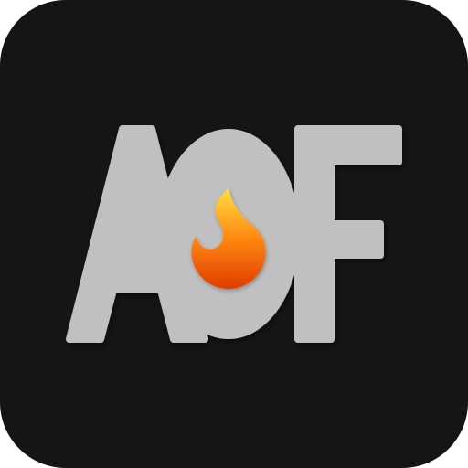

<p align="center">
  
</p>

<h3 align="center">AllOnFire 🔥</h3>

<br />

<p align="center">
  
  
  
  
  
</p>

---

## 🔥 About

AllOnFire is a Turborepo-powered monorepo with shared packages, apps, and infrastructure managed through pnpm workspaces. It provides a unified development experience with shared TypeScript config, UI components, database services, and CI/CD pipelines across all projects.

## 📱 Apps

<!-- Add a screenshot for each app as it's built -->
<!-- <p align="center"></p> -->

<p align="center">
  
</p>

<h3 align="center">Social Media Dashboard</h3>

<p align="center">
  
  
  
  
  
  
</p>

<p align="center">
  Discover topics, generate AI content, and publish to Twitter and LinkedIn from a single dashboard.
</p>

<p align="center">
  📖 <a href="apps/social/">See the full docs</a>
</p>

<br />

<p align="center">
  
</p>

<h3 align="center">Photo Gallery</h3>

<p align="center">
  
  
  
  
  
  
</p>

<p align="center">
  Private photo gallery with i18n support, S3/MinIO storage, and blurhash placeholders.
</p>

<p align="center">
  📖 <a href="apps/laura/">See the full docs</a>
</p>

---

## 📦 Packages

Shared libraries consumed by all apps in the monorepo.

| | Package | Description |
|-|---------|-------------|
| 🗄️ | **[@allonfire/database](packages/database/)** | Prisma ORM, PostgreSQL services, encrypted token storage |
| 🤖 | **[@allonfire/content-generator](packages/content-generator/)** | AI content generation (Anthropic, Gemini, Groq, OpenRouter) |
| 📤 | **[@allonfire/social-publisher](packages/social-publisher/)** | Platform adapters, OAuth flows, image processing |
| 🔐 | **[@allonfire/auth](packages/auth/)** | Shared BetterAuth config, session guards, login UI |
| 📁 | **[@allonfire/storage](packages/storage/)** | S3/MinIO file uploads, image processing (Sharp + blurhash) |
| 🎨 | **[@allonfire/ui](packages/ui/)** | Shared UI components (shadcn/ui + Radix + Tailwind) |
| 🪝 | **[@allonfire/hooks](packages/hooks/)** | Responsive breakpoint hooks |
| 🔧 | **[@allonfire/utils](packages/utils/)** | Type-safe utility functions |
| ⚙️ | **[@allonfire/config](packages/config/)** | Shared TypeScript configuration |

## 🗂️ Project Structure

<p>
  
  
  
  
  
</p>

Apps, shared packages, infrastructure, and CI/CD — all managed through pnpm workspaces and Turborepo.

```
allonfire/
  apps/
    social/               Next.js social media dashboard
    laura/                Next.js photo gallery app
  packages/
    auth/                 Shared BetterAuth config
    content-generator/    AI content generation
    database/             Prisma ORM + services
    social-publisher/     Platform adapters + OAuth
    storage/              S3/MinIO uploads + image processing
    ui/                   Shared UI components
    hooks/                React hooks
    utils/                Utility functions
    config/               TypeScript config
  docker/                 Docker Compose + Dockerfile
  n8n/                    Workflow automation
  docs/                   Project documentation
  .github/                CI/CD workflows
```

## 🏗️ Infrastructure

Production deployment stack powering all apps and services.

| | Component | Stack |
|-|-----------|-------|
| 🖥️ | **VPS** | Hetzner |
| 🚀 | **Orchestrator** | Dokploy |
| 🐘 | **Database** | PostgreSQL 16 |
| 🔒 | **Proxy** | Traefik + Let's Encrypt SSL |
| ⚡ | **Automation** | n8n (self-hosted) |
| 🔄 | **CI** | GitHub Actions |

---

<p align="center">
  Made with ❤️ and way too much ☕
</p>

