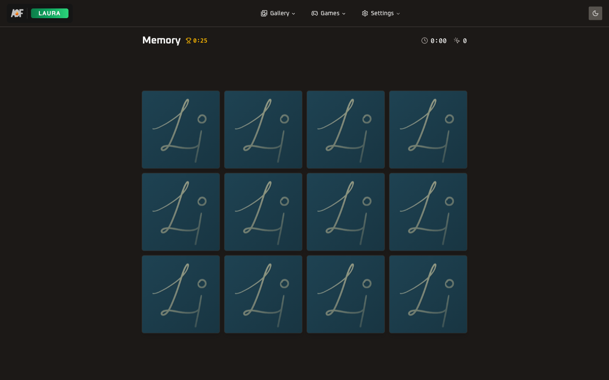
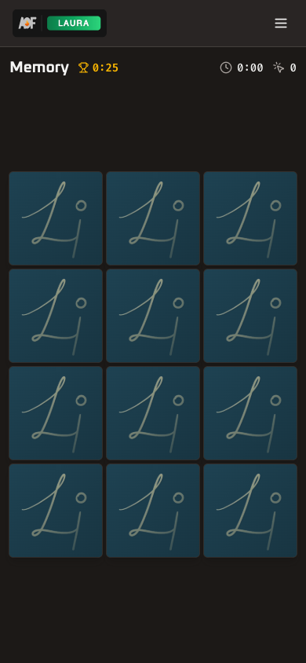
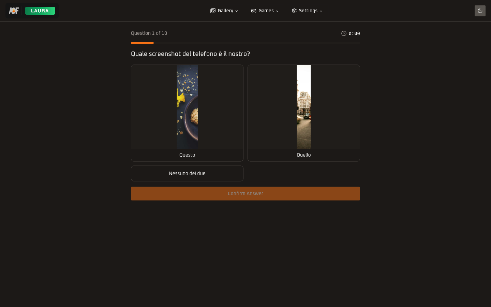
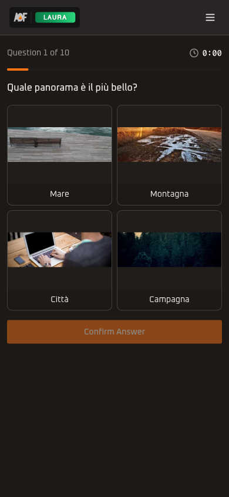

<p align="center">
  
</p>

<h1 align="center">Photos & Games</h1>

<p align="center">
  
  
  
  
  
  
  
</p>

<p align="center">
  Private family photo gallery with masonry grid, infinite scroll, memory and quiz games, i18n support, and blurhash placeholders.
</p>

---

<p align="center">
  
  &nbsp;&nbsp;
  
</p>

## 📱 Routes

| | Route | Page | Feature |
|-|-------|------|---------|
| 🖼️ | `/` | Photo gallery with masonry grid and infinite scroll | [gallery](src/features/gallery/) |
| ❤️ | `/favorites` | Favorited photos | [gallery](src/features/gallery/) |
| 📤 | `/upload` | Photo upload with HEIC conversion (USER/ADMIN) | [upload](src/features/upload/) |
| ⚙️ | `/settings` | Language, appearance, user info | [settings](src/features/settings/) |
| 🎮 | `/games` | Game hub with animated cards | [games](src/features/games/) |
| 🃏 | `/games/memory` | Memory card matching game | [games](src/features/games/) |
| 🏆 | `/games/memory/leaderboard` | Memory scores | [games](src/features/games/) |
| ❓ | `/games/quiz` | Multiple choice quiz game | [games](src/features/games/) |
| 🏆 | `/games/quiz/leaderboard` | Quiz scores | [games](src/features/games/) |
| ✏️ | `/games/quiz/edit` | Quiz question management (ADMIN) | [games](src/features/games/) |
| ➕ | `/games/quiz/edit/new` | Create new quiz question (ADMIN) | [games](src/features/games/) |
| ✏️ | `/games/quiz/edit/[id]` | Edit existing quiz question (ADMIN) | [games](src/features/games/) |

## 🖼️ Features Gallery

<p align="center">
  
  &nbsp;&nbsp;
  
</p>

**📤 [Upload](src/features/upload/)** — Drag-and-drop photo upload with HEIC auto-conversion, S3/MinIO storage, and real-time preview.

---

<p align="center">
  
  &nbsp;&nbsp;
  
</p>

**🎮 [Games Hub](src/features/games/)** — Memory and Quiz game selection with Framer Motion animated cards and score summaries.

---

<p align="center">
  
  &nbsp;&nbsp;
  
</p>

**🃏 [Memory Game](src/features/games/)** — Card matching game using gallery photos. Timer-based scoring with leaderboard.

---

<p align="center">
  
  &nbsp;&nbsp;
  
</p>

**❓ [Quiz Game](src/features/games/)** — Multiple choice questions with image support. Score tracking and leaderboard.

---

<p align="center">
  
  &nbsp;&nbsp;
  
</p>

**⚙️ [Settings](src/features/settings/)** — Language switcher (Italian/English), theme toggle, user profile info, and sign out.

## 🏗️ Architecture

```
pages ──> features ──> shared packages

  app/[locale]/(dashboard)/
    page.tsx           server component, fetches data
        |
    features/{name}/
      components/      UI (client components)
      actions/         server actions (mutations)
      hooks/           client state management
      utils/           shared helpers

  i18n: next-intl wraps all routes under [locale]
  roles: UserRoleProvider guards mutations for viewers
```

Each feature is self-contained with its own components, actions, and hooks. No barrel `index.ts` files — import directly from the specific file.

## 🔧 Development

```bash
pnpm dev          # Start on :3200
pnpm dev:mobile   # Start on :3201 (Tailscale)
pnpm build        # Production build
pnpm check-types  # TypeScript check
pnpm seed-photos  # Seed sample photos
```

## 🔑 Environment Variables

| Variable | Required | Description |
|----------|:--------:|-------------|
| `DATABASE_URL` | ✅ | PostgreSQL connection string |
| `BETTER_AUTH_SECRET` | ✅ | Auth session encryption key |
| `BETTER_AUTH_URL` | ✅ | App base URL for auth callbacks |
| `MINIO_ENDPOINT` | ✅ | MinIO/S3 endpoint URL |
| `MINIO_ACCESS_KEY` | ✅ | MinIO/S3 access key |
| `MINIO_SECRET_KEY` | ✅ | MinIO/S3 secret key |
| `MINIO_BUCKET` | ✅ | MinIO/S3 bucket name |
| `VIEWER_EMAIL` | | Email for auto-created viewer account |
| `VIEWER_PASSWORD` | | Password for auto-created viewer account |

---

<p align="center">
  ⬅️ <a href="../../README.md">Back to monorepo root</a>
</p>
