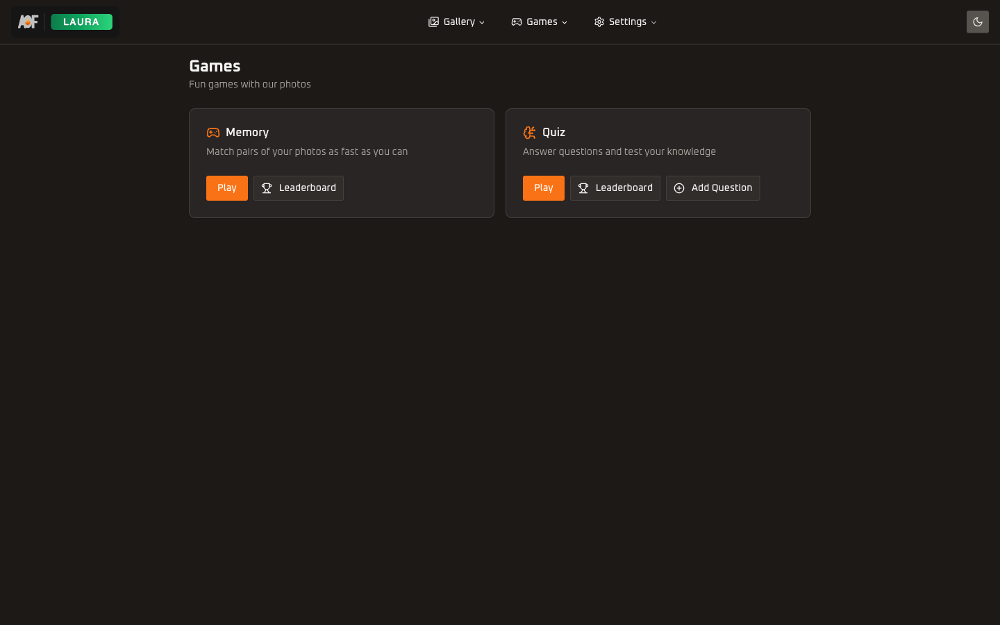

<h1 align="center">Games</h1>

<p align="center">
  
  
  
</p>

<p align="center">Memory card matching and quiz games with leaderboards, quiz CRUD, and score tracking.</p>

---

<p align="center">
  
  &nbsp;&nbsp;
  
</p>

## 📁 Directory Structure

```
games/
  actions/
    games.ts                  Server actions for memory game (photo cards, score submit, leaderboard)
    quiz.ts                   Server actions for quiz game (questions, score submit, CRUD)
  hooks/
    use-memory-game.ts        Memory game state machine (card flipping, matching, timer, score submit)
    use-quiz-game.ts          Quiz game state machine (answer selection, progression, timer, score submit)
    use-memory-grid-size.ts   Responsive grid sizing via ResizeObserver (3x4 mobile, 4x3 tablet+)
  utils/
    format-time.ts            Formats milliseconds to "M:SS" string
  components/
    game-hub.tsx              Game selection cards (entry point for /games)
    game-complete-dialog.tsx   Memory game completion dialog (time, moves, new record badge)
    memory-board.tsx          Memory game board (grid, header with timer/moves/best time)
    memory-card.tsx           Individual memory card with 3D flip animation
    quiz-board.tsx            Quiz game board (progress bar, question display, confirm button)
    quiz-question.tsx         Quiz question display with text and image answer layouts
    quiz-results.tsx          Quiz completion screen (score, accuracy, new record, mistakes link)
    quiz-mistakes.tsx         Review of incorrect quiz answers with correct/wrong comparison
    leaderboard-shared.tsx    Shared utilities: getInitials(), RankBadge (1st/2nd/3rd badges)
    leaderboard-table.tsx     Memory leaderboard table (ranked by time, shows moves)
    quiz-leaderboard-table.tsx  Quiz leaderboard table (ranked by score/10, shows time)
    leaderboard-stats.tsx     Stats cards grid (total games, unique players, best time, avg time)
    quiz-question-list.tsx    Admin question list with search, edit/delete actions, delete dialog
    quiz-question-form.tsx    Admin question create/edit form with image uploads for question + answers
```

---

## 🧩 Component Hierarchy

### 🃏 Memory Game

```
MemoryBoard (client)
  Header (title, best time trophy, clock, move counter)
  Grid container (responsive via useMemoryGridSize)
    MemoryCard x12 (3D flip with blur placeholder)
  GameCompleteDialog (modal on completion)
```

### ❓ Quiz Game

```
QuizBoard (client)
  Header (progress counter, timer)
  Progress bar
  QuizQuestion
    Question image (optional)
    Question text
    TextAnswerList or ImageAnswerGrid (auto-detected)
  Confirm button
  --- on complete ---
  QuizResults
    Score summary, time, accuracy/new record
    QuizMistakes (toggleable review of wrong answers)
```

### 🏆 Leaderboards (shared structure)

```
Page (server) -> getLeaderboardAction
  LeaderboardStats (4 stat cards)
  LeaderboardTable or QuizLeaderboardTable
```

### ✏️ Quiz CRUD (admin only)

```
QuizQuestionList
  Search input
  New question link
  Question rows (thumbnail, text, answer count badge, edit/delete)
  Delete confirmation dialog

QuizQuestionForm (create or edit mode)
  Back link
  Question text textarea
  Question image upload (with preview, remove, fullscreen portal)
  AnswerRow x2-4
    Answer text textarea
    Answer image upload (with preview, remove, fullscreen portal)
    Correct answer toggle
    Remove answer button
  Add answer button (up to 4)
  Submit button
```

---

## 🎮 Game Mechanics

### 🃏 Memory Game

- 6 random photos from user's gallery (or all photos for viewers) are duplicated into 12 cards
- Cards are shuffled using Fisher-Yates algorithm (server-side in `games.ts`)
- Player flips two cards per move; matched pairs stay revealed, mismatches flip back after 800ms
- Timer starts on first card flip, runs via 1-second interval
- Game states: `idle` -> `playing` -> `checking` (during match evaluation) -> `complete`
- Score auto-submits on completion (skipped for viewer role)
- Requires minimum 6 photos to play; viewers draw from all users' photos

### ❓ Quiz Game

- 10 random questions fetched from database
- Player selects one answer, then confirms; correct/wrong feedback with bounce/shake animation
- Timer starts on first answer selection
- 300ms transition between questions with slide animation
- Game states: `idle` -> `playing` -> `complete`
- Score = correctCount (primary) + time (tiebreaker for "new best" calculation)
- Mistakes are tracked and reviewable after completion with side-by-side comparison

---

## 🏆 Scoring and Leaderboards

### 🃏 Memory

- Ranked by time (lower is better)
- "New best" = faster time than user's previous best
- Leaderboard shows: rank, player, time, moves, date

### ❓ Quiz

- Ranked by score (higher is better), time as tiebreaker
- "New best" = more correct answers, or same correct count with faster time
- Leaderboard shows: rank, player, score/10, time, date

Both leaderboards fetch top 25 entries and include global stats (total games, unique players, best time, average time).

---

## 🔐 Access Control

- **Viewers:** Can play both games but scores are not submitted (`viewer-skipped` state)
- **Users:** Can play and submit scores
- **Admins:** Can play, submit scores, and manage quiz questions (create, edit, delete)
- Memory: `checkMutationAccess` guards score submission; `checkAppAccess` guards photo fetching
- Quiz CRUD: `checkAdminAccess` guards all create/update/delete actions
- Client-side: `useIsViewer()` and `useIsAdmin()` from `UserRoleProvider` for UI restrictions

---

## ✏️ Quiz CRUD Details

- Question text: 1-500 characters
- 2-4 answers per question, exactly one marked correct
- Answer text: 1-200 characters
- Optional images for question and each answer (processed via `@allonfire/storage`)
- Images are processed (full + thumbnail) and uploaded to S3 paths: `quiz/questions/` and `quiz/answers/`
- HEIC to JPEG conversion supported via `convertHeicToJpeg`
- Edit mode preserves existing images unless explicitly removed or replaced
- Form uses `FormData` serialization for server action submission
- Image preview uses `createPortal` for fullscreen overlay

---

## 📥 Import Patterns

From pages:

```ts
// Game hub (games/page.tsx)
import { GameHub } from "@/features/games/components/game-hub";

// Memory game (games/memory/page.tsx)
import { MemoryBoard } from "@/features/games/components/memory-board";
import { getMemoryPhotosAction, getBestTimeAction } from "@/features/games/actions/games";

// Quiz game (games/quiz/page.tsx)
import { QuizBoard } from "@/features/games/components/quiz-board";
import { getQuizQuestionsAction } from "@/features/games/actions/quiz";

// Leaderboards (games/memory/leaderboard/page.tsx, games/quiz/leaderboard/page.tsx)
import { LeaderboardStats } from "@/features/games/components/leaderboard-stats";
import { LeaderboardTable } from "@/features/games/components/leaderboard-table";
import { QuizLeaderboardTable } from "@/features/games/components/quiz-leaderboard-table";
import { getLeaderboardAction } from "@/features/games/actions/games";
import { getQuizLeaderboardAction } from "@/features/games/actions/quiz";

// Quiz CRUD (games/quiz/edit/page.tsx, games/quiz/edit/[id]/page.tsx)
import { QuizQuestionList } from "@/features/games/components/quiz-question-list";
import { QuizQuestionForm } from "@/features/games/components/quiz-question-form";
import { getQuizQuestionsListAction, getQuizQuestionByIdAction } from "@/features/games/actions/quiz";
```

No barrel `index.ts` files -- always import directly from the specific file.
