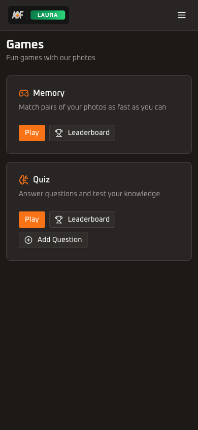

<h1 align="center">Layout</h1>

<p align="center">
  
  
</p>

<p align="center">Responsive navigation shell with desktop top bar, mobile hamburger menu, and auto-hide behavior.</p>

---

<p align="center">
  
  &nbsp;&nbsp;
  
</p>

## 📁 Directory Structure

```
layout/
  constants.ts                        # SCROLL_CONTAINER_SELECTOR for auto-hide targeting
  hooks/
    use-auto-hide-navbar.ts           # Scroll-driven show/hide logic for gallery pages
  components/
    top-bar.tsx                       # Main header: logo, desktop nav, mobile menu button
    desktop-nav.tsx                   # NavigationMenu with dropdown sections (lg+)
    mobile-nav.tsx                    # Right-side Sheet overlay with nav links and sign-out
    nav-links.ts                     # Navigation data: sections, links, active-state logic
    nav-link-content.tsx             # Shared link content (icon, label, checkmark, description)
    page-container.tsx               # Centered max-w-4xl content wrapper
```

---

## 🏗️ Component Hierarchy

```
DashboardLayout (server)
  UserRoleProvider
    TopBar
      Logo (mobile + desktop variants)
      DesktopNav (lg+)
        NavigationMenu
          NavigationMenuTrigger (per section)
          NavigationMenuContent
            NavLinkContent (per link)
      Menu button (mobile only)
      ThemeToggle (desktop only)
      MobileNav (Sheet, on demand)
        Avatar + user info
        Nav sections with links
        Sign-out button
    main (page content)
```

---

## 📱 Responsive Behavior

| Viewport    | Breakpoint | Visible Components                             |
|-------------|------------|------------------------------------------------|
| Mobile      | < 1024px   | TopBar with logo + hamburger, MobileNav sheet  |
| Desktop     | >= 1024px  | TopBar with logo + DesktopNav dropdowns + ThemeToggle |

The mobile/desktop split uses `lg:` (1024px). Mobile shows a smaller logo (120x36), desktop shows a larger one (156x46). The hamburger button is hidden at `lg:` and the NavigationMenu is hidden below `lg:`.

---

## 🫣 Auto-Hide Navbar

On gallery pages (`/` and `/favorites`), the navbar auto-hides to maximize photo viewing area:

- Hidden on mount (no flash via `useLayoutEffect`)
- Scrolling up reveals the navbar (50px threshold to prevent flickering)
- Scrolling down hides it
- 3 seconds of scroll inactivity when not at top hides it
- Hovering the header or opening the mobile sheet pauses auto-hide
- Non-gallery pages always show the navbar

The hook targets the scroll container via `document.querySelector("[data-scroll-container]")`, matching the `data-scroll-container` attribute set on the main content wrapper in `layout.tsx`.

When auto-hide is active, the header switches from `sticky` to `fixed` positioning with a backdrop blur effect using `color-mix(in srgb, ...)` for Safari compatibility.

---

## 🧭 Navigation Structure

Defined in `nav-links.ts` as `navSections` array with three sections:

| Section  | Links                                  |
|----------|----------------------------------------|
| Gallery  | Gallery (/), Favorites (/favorites), Upload (/upload, viewer-restricted) |
| Games    | Games (/games), Memory (/games/memory), Quiz (/games/quiz), Quiz Edit (/games/quiz/edit, admin-only) |
| Settings | Settings (/settings)                   |

### 🎯 Active State Logic

`isLinkActive(pathname, href)` handles exact matches and prefix matches with specificity: a parent link (e.g., `/games`) is only highlighted if no child link (e.g., `/games/memory`) matches more specifically.

### 🔒 Role-Based Visibility

Links with `viewerRestricted: true` appear disabled (grayed out, `cursor-not-allowed`) for viewer-role users. Links with `adminOnly: true` appear disabled for non-admin users. Both desktop and mobile nav enforce this via `useIsViewer()` and `useIsAdmin()` from `UserRoleProvider`.

---

## 🖥️ Desktop Nav SSR Handling

`DesktopNav` renders a static placeholder on the server (matching the trigger layout) and swaps in the interactive `NavigationMenu` after mount via a `mounted` state flag. This avoids hydration mismatches from role-dependent rendering.

---

## 📥 Import Patterns

```ts
// From dashboard layout
import { TopBar } from "@/features/layout/components/top-bar";
import { PageContainer } from "@/features/layout/components/page-container";

// From other features (if needed)
import { SCROLL_CONTAINER_SELECTOR } from "@/features/layout/constants";
```

No barrel `index.ts` files -- always import directly from the specific file.
