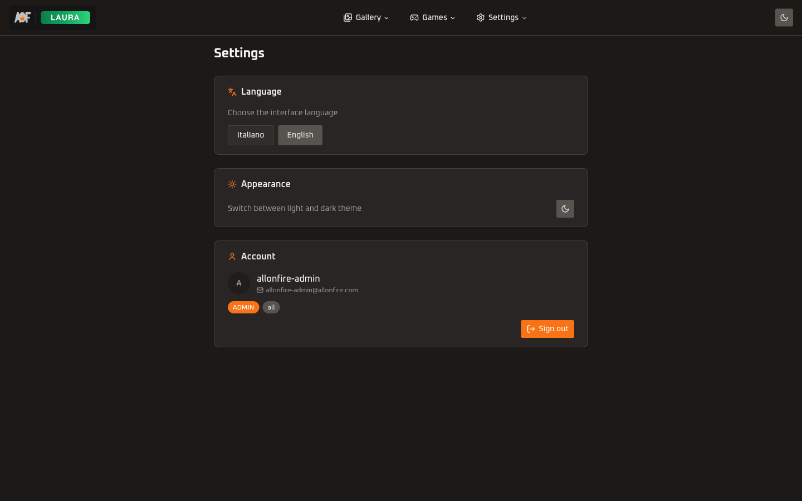
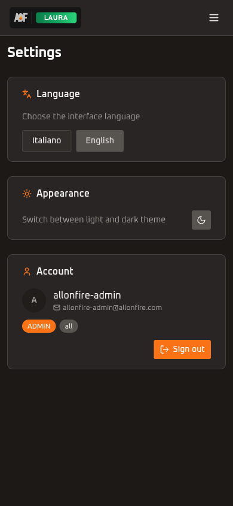

<h1 align="center">Settings</h1>

<p align="center">
  
  
</p>

<p align="center">Language switcher (Italian/English), appearance toggle, user profile, and sign out.</p>

---

<p align="center">
  
  &nbsp;&nbsp;
  
</p>

## 📁 Directory Structure

```
settings/
  components/
    language-card.tsx         # Card wrapper for the language switcher
    language-switcher.tsx     # Italian/English locale toggle buttons
    appearance-card.tsx       # Card with light/dark theme toggle
    user-info-card.tsx        # User avatar, name, email, role badge, sign-out button
    sign-out-button.tsx       # Standalone sign-out button (legacy, superseded by UserInfoCard)
```

---

## 🏗️ Component Hierarchy

```
SettingsPage (server)
  PageContainer
    AnimatedPageWrapper
      LanguageCard
        LanguageSwitcher
      AppearanceCard
        ThemeToggle (from @allonfire/ui)
      UserInfoCard
```

The settings page is a Server Component that fetches user data via `checkAppAccess(auth, "laura")` and passes `name`, `email`, `role`, and `allowedApps` down to `UserInfoCard` as props. `LanguageCard` and `AppearanceCard` need no server data.

---

## ✨ Components

### 🌐 LanguageCard / LanguageSwitcher

`LanguageCard` is a card wrapper. `LanguageSwitcher` renders two buttons (Italian, English) using `useLocale()` for the current locale. Switching calls `router.replace(pathname, { locale: newLocale })` via next-intl's `useRouter` and `usePathname` from `@/i18n/navigation`, which preserves the current route while changing the locale segment.

### 🎨 AppearanceCard

Wraps the shared `ThemeToggle` component from `@allonfire/ui` inside a card with a description. The toggle itself manages the `next-themes` state internally.

### 👤 UserInfoCard

Displays user info (avatar initials, name/email, role badge, allowed apps badges) and a sign-out button. Receives all data as props from the server page. Initials are derived by splitting on whitespace or `@`. Sign-out calls `authClient.signOut()` from `@allonfire/auth/client` then redirects to `/login`.

### 🚪 SignOutButton

A standalone sign-out button component. The same sign-out logic is duplicated inside `UserInfoCard`, so this component is only useful if a sign-out button is needed outside the settings page context.

---

## 📥 Import Patterns

```ts
// From the settings page
import { LanguageCard } from "@/features/settings/components/language-card";
import { AppearanceCard } from "@/features/settings/components/appearance-card";
import { UserInfoCard } from "@/features/settings/components/user-info-card";
import { SignOutButton } from "@/features/settings/components/sign-out-button";
```

No barrel `index.ts` files -- always import directly from the specific file.
