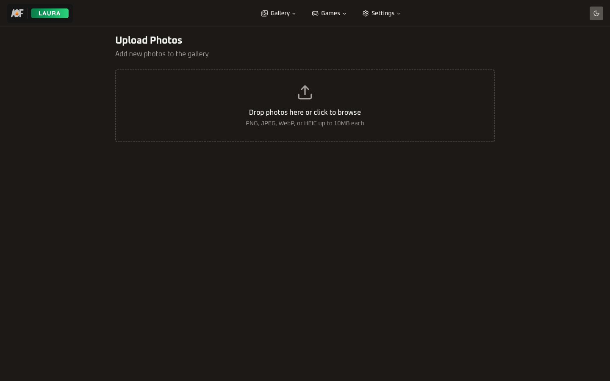

<h1 align="center">Upload</h1>

<p align="center">
  
  
  
</p>

<p align="center">Drag-and-drop photo upload with HEIC auto-conversion, S3/MinIO storage, and real-time preview.</p>

---

<p align="center">
  
  &nbsp;&nbsp;
  
</p>

---

## 📁 Directory Structure

```
upload/
  actions/
    upload.ts               # Server action: validate, process, upload to S3, create DB record
  components/
    upload-client.tsx        # Orchestrator: file state, HEIC conversion, sequential upload loop
    upload-dropzone.tsx      # Drag-and-drop zone with hidden file input
    upload-preview-grid.tsx  # Thumbnail grid with remove buttons and fullscreen preview modal
```

---

## 🧩 Component Hierarchy

```
Server Page (role guard)
  UploadClient
    UploadDropzone
    UploadPreviewGrid
    Progress bar (during upload)
    Upload button + file count / size warning
```

---

## 🔄 Upload Flow

1. **File selection**: User drops files on `UploadDropzone` or clicks to open file picker. Accepted types: JPEG, PNG, WebP, HEIC, HEIF.

2. **HEIC conversion**: `addFiles` in `UploadClient` runs all files through `convertHeicToJpeg`. Safari uses native `createImageBitmap` + `OffscreenCanvas`. Chrome/Firefox fall back to the `heic2any` library (dynamically imported). Non-HEIC files pass through unchanged.

3. **Preview**: Converted files get `URL.createObjectURL` preview URLs. `UploadPreviewGrid` renders thumbnails in a responsive grid (2/3/4 columns). Each thumbnail is clickable for a fullscreen preview modal. Dimensions are measured from blob URLs for aspect-ratio-aware rendering.

4. **Validation**: Client-side total size check against `MAX_TOTAL_SIZE` (50 MB). Individual files are validated server-side via `validateImageFile` (type check + `MAX_FILE_SIZE` of 10 MB per file).

5. **Upload**: Files are uploaded sequentially (one at a time) via `uploadPhotoAction` server action. Each file is sent as `FormData`. Progress is tracked as `current/total` and displayed with a `Progress` bar.

6. **Server processing**: `uploadPhotoAction` calls `processPhoto` (from `@allonfire/storage`) to resize, generate thumbnail, and compute blurhash. Full and thumbnail versions are uploaded to S3/MinIO in parallel. A `Photo` record is created in the database.

7. **Cleanup**: Successfully uploaded files are removed from the preview. Object URLs are revoked. The `["photos"]` query is invalidated to refresh the gallery.

---

## ✅ File Validation

Defined in `@/lib/file-validation`:

| Constant | Value | Purpose |
|----------|-------|---------|
| `MAX_FILE_SIZE` | 10 MB | Per-file server-side limit |
| `MAX_TOTAL_SIZE` | 50 MB | Client-side total batch limit |
| `ACCEPTED_IMAGE_TYPES` | JPEG, PNG, WebP, HEIC, HEIF | Allowed MIME types |
| `ACCEPTED_INPUT_STRING` | Comma-joined MIME types | Used for `<input accept>` attribute |

---

## 🔄 HEIC Conversion

Defined in `@/lib/convert-heic`:

- **Safari path**: Uses `createImageBitmap` (native HEIC support) + `OffscreenCanvas.convertToBlob` at 92% JPEG quality
- **Fallback path**: Dynamically imports `heic2any` library for Chrome/Firefox
- **Output**: Returns a new `File` with `.jpg` extension and `image/jpeg` MIME type
- Non-HEIC files are returned unchanged (no conversion)

---

## 🖼️ Preview Grid

`UploadPreviewGrid` features:

- Responsive grid: 2 columns (mobile), 3 columns (sm), 4 columns (md+)
- Each thumbnail has a red X button for removal
- Click-to-preview opens a fullscreen modal via `createPortal` to `document.body`
- Dimensions are measured from blob URLs using `Image.onload` for aspect-ratio-aware preview
- Escape key closes the preview modal
- Stale dimension entries are cleaned up when files are removed

---

## 📥 Import Patterns

```ts
// Server action (used by upload-client)
import { uploadPhotoAction } from "@/features/upload/actions/upload";

// Client wrapper (used by page.tsx)
import { UploadClient } from "@/features/upload/components/upload-client";
```

No barrel `index.ts` files -- always import directly from the specific file.
