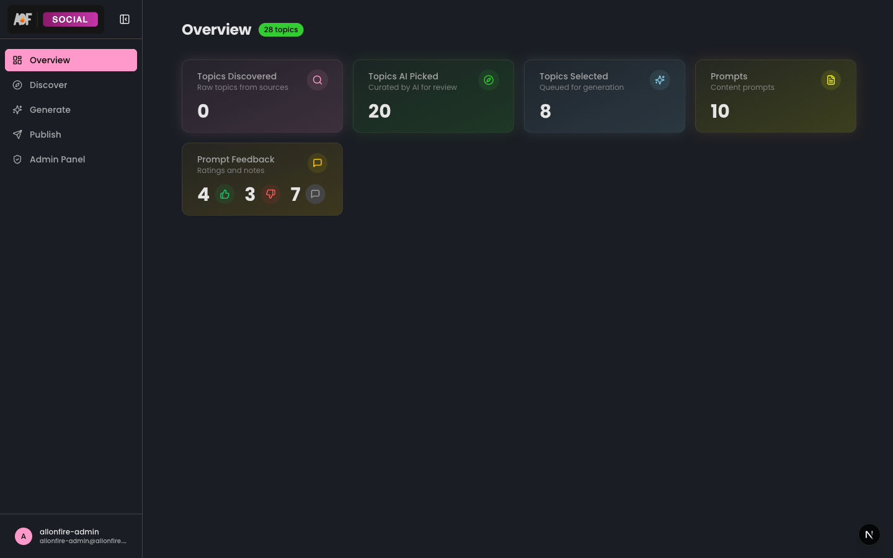
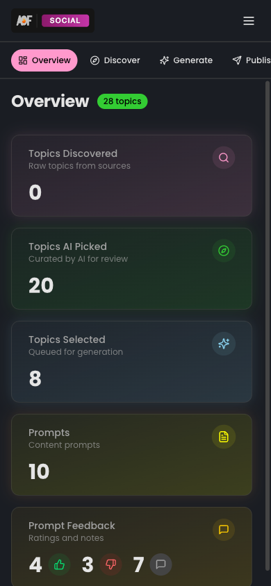
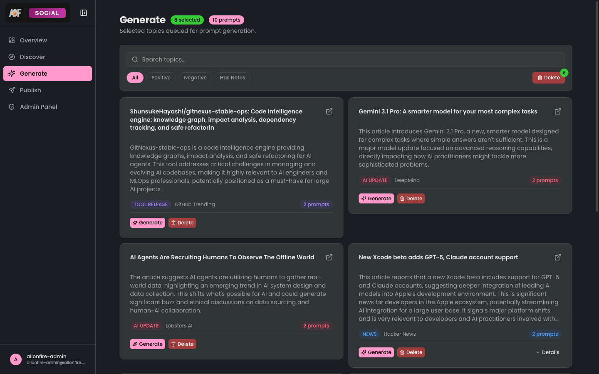
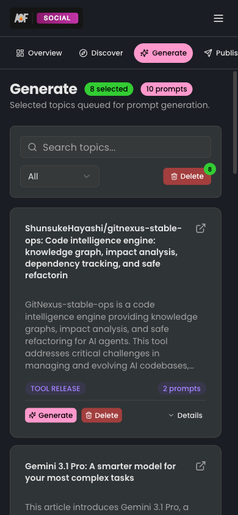
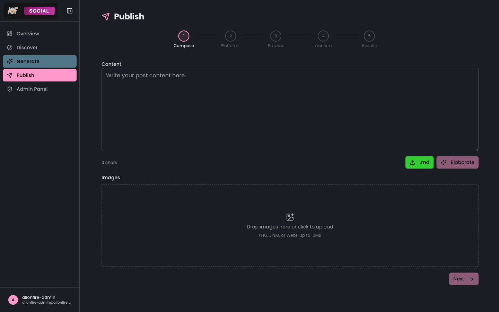
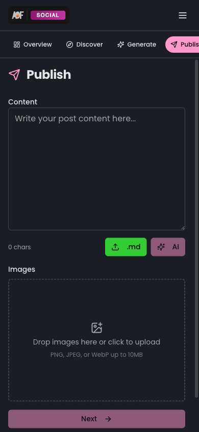

<p align="center">
  
</p>

<h3 align="center">Social Media Dashboard</h3>

<p align="center">
  
  
  
  
  
  
</p>

<p align="center">
  Discover trending topics, generate AI-powered content, and publish to Twitter and LinkedIn — all from one dashboard.
</p>

---

<p align="center">
  
  &nbsp;&nbsp;
  
</p>

## 📱 Routes

| | Route | Page | Feature |
|-|-------|------|---------|
| 📊 | `/` | Overview with pipeline stats | [overview](src/features/overview/) |
| 🔍 | `/discover` | Browse and manage discovered topics | [topics](src/features/topics/) |
| ✨ | `/generate` | Trigger and monitor content generation | [generation](src/features/generation/) |
| 📝 | `/generate/[topicId]` | Single topic generation detail | [generation](src/features/generation/) |
| 📤 | `/publish` | Multi-step publishing wizard | [publish](src/features/publish/) |
| 👥 | `/admin/users` | User management (admin only) | [admin](src/features/admin/) |
| 🤖 | `/admin/providers` | AI provider configuration | [admin](src/features/admin/) |
| ⚙️ | `/settings/general` | Platform connections and preferences | [settings](src/features/settings/) |

## 🖼️ Features Gallery

<p align="center">
  
  &nbsp;&nbsp;
  
</p>

**🔍 [Discover](src/features/topics/)** — Browse AI-curated topics from 9 sources. Filter by category, search, select for generation, or bulk delete.

---

<p align="center">
  
  &nbsp;&nbsp;
  
</p>

**✨ [Generate](src/features/generation/)** — View selected topics and trigger AI content generation. Filter by feedback status, manage prompts.

---

<p align="center">
  
  &nbsp;&nbsp;
  
</p>

**📤 [Publish](src/features/publish/)** — 5-step wizard: compose content, select platforms, AI-adapt per platform, confirm, and publish. Supports image upload with drag-to-reorder.

---

<p align="center">
  
  &nbsp;&nbsp;
  
</p>

**👥 [Admin](src/features/admin/)** — Manage team members and configure AI providers (Anthropic, OpenRouter, Google Gemini, Groq).

---

<p align="center">
  
  &nbsp;&nbsp;
  
</p>

**⚙️ [Settings](src/features/settings/)** — Connect social media accounts (Twitter, LinkedIn), view active AI model, toggle theme.

## 🏗️ Architecture

```
pages ──> features ──> shared packages

  app/(dashboard)/
    page.tsx           server component, fetches data
        |
    features/{name}/
      components/      UI (client components)
      actions/         server actions (mutations)
      hooks/           client state management
      constants/       shared config
```

Each feature is self-contained with its own components, actions, and hooks. No barrel `index.ts` files — import directly from the specific file.

## 🔧 Development

```bash
pnpm dev          # Start on :3100
pnpm dev:mobile   # Start on :3101 (Tailscale)
pnpm build        # Production build
pnpm check-types  # TypeScript check
```

## 🔑 Environment Variables

| Variable | Required | Description |
|----------|:--------:|-------------|
| `DATABASE_URL` | ✅ | PostgreSQL connection string |
| `BETTER_AUTH_SECRET` | ✅ | Auth session encryption key |
| `BETTER_AUTH_URL` | ✅ | App base URL for auth callbacks |
| `N8N_API_KEY` | | Webhook authentication key |
| `TWITTER_CLIENT_ID` | | Twitter OAuth 2.0 client ID |
| `TWITTER_CLIENT_SECRET` | | Twitter OAuth 2.0 client secret |
| `LINKEDIN_CLIENT_ID` | | LinkedIn OAuth client ID |
| `LINKEDIN_CLIENT_SECRET` | | LinkedIn OAuth client secret |
| `GOOGLE_CLIENT_ID` | | YouTube OAuth client ID |
| `GOOGLE_CLIENT_SECRET` | | YouTube OAuth client secret |
| `VIEWER_EMAIL` | | Email for auto-created viewer account |
| `VIEWER_PASSWORD` | | Password for auto-created viewer account |

---

<p align="center">
  ⬅️ <a href="../../README.md">Back to monorepo root</a>
</p>
