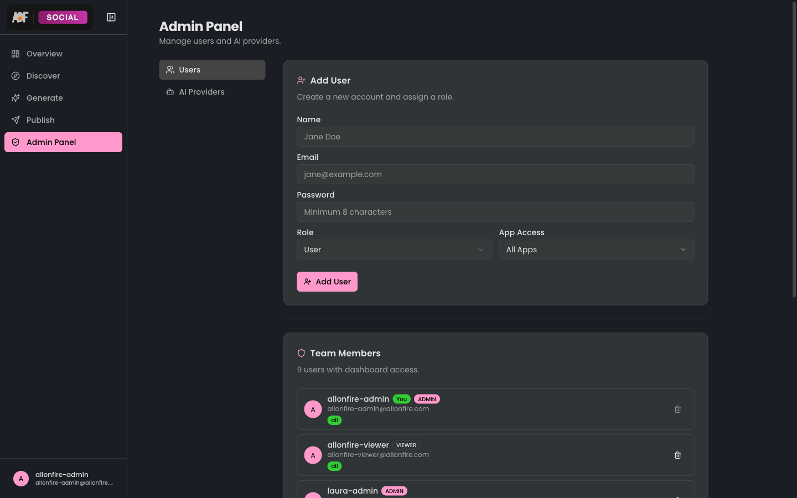
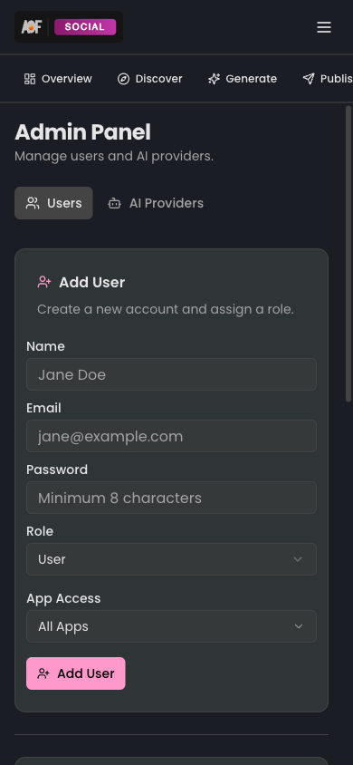
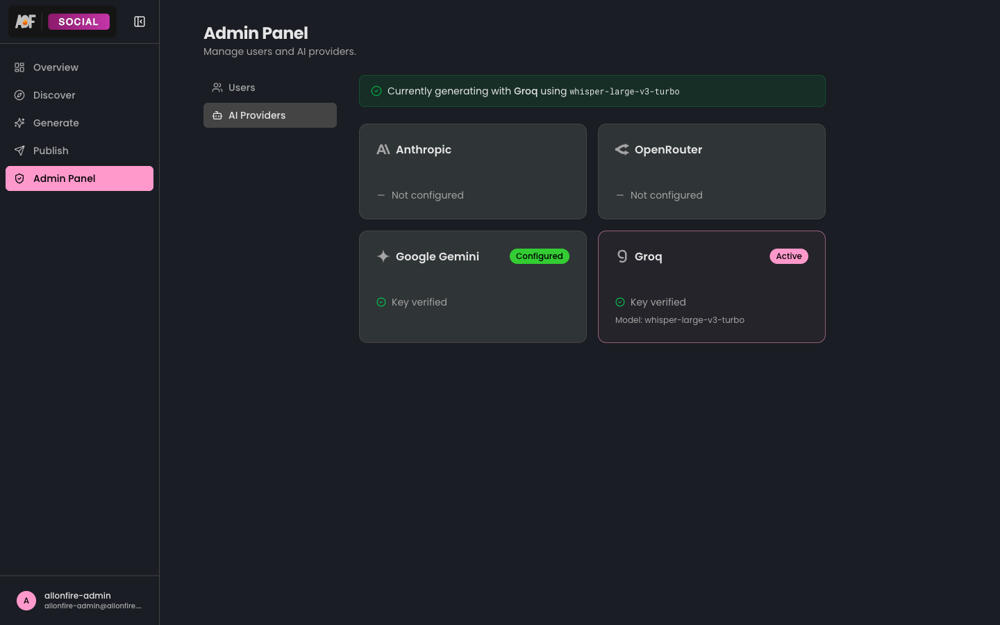

<h1 align="center">Admin</h1>

<p align="center">
  
  
</p>

<p align="center">
  User management and AI provider configuration panel. Restricted to users with the <b>ADMIN</b> role — enforced at the layout level with an auth guard and a dedicated sub-navigation menu.
</p>

## 📸 Screenshots

<p align="center">
  
  &nbsp;&nbsp;
  
</p>

<p align="center">
  
</p>

## 📁 Directory Structure

```
admin/
  actions/
    providers.ts                Save, test, and delete AI provider configs
    users.ts                    Create, delete, and change user roles
  components/
    add-user-form.tsx           Create new user form (react-hook-form + Zod)
    admin-sub-nav.tsx           Tab navigation between Users and AI Providers
    provider-card.tsx           Status card showing provider health and model count
    provider-config-panel.tsx   API key input, model selection, and test connection
    provider-icons.tsx          SVG icons for each supported provider
    providers-hub.tsx           Grid layout displaying all provider cards
    user-detail.tsx             Individual user page with role management
    user-list.tsx               Team members table with actions
```

## :sparkles: Key Capabilities

- **4 AI providers** — Anthropic, OpenRouter, Gemini, and Groq, each with independent configuration
- **Role-based access** — Two roles: `ADMIN` (full access) and `USER` (dashboard only)
- **API key encryption** — Keys are encrypted at rest and masked in the UI
- **Connection testing** — One-click test to verify provider credentials before saving

## :arrows_counterclockwise: Data Flow

```
AdminSubNav (tab switch)
  Users tab
    UserList  ->  users.ts actions (create / delete / role change)
      AddUserForm (react-hook-form + Zod validation)
      UserDetail (role toggle, delete confirmation)

  AI Providers tab
    ProvidersHub  ->  providers.ts actions (save / test / delete)
      ProviderCard (status indicator)
        ProviderConfigPanel (API key + model config)
```

## :link: Import Pattern

```ts
import { UserList } from "@/features/admin/components/user-list";
import { ProvidersHub } from "@/features/admin/components/providers-hub";
import { AdminSubNav } from "@/features/admin/components/admin-sub-nav";
```

No barrel `index.ts` files — always import directly from the specific file.
