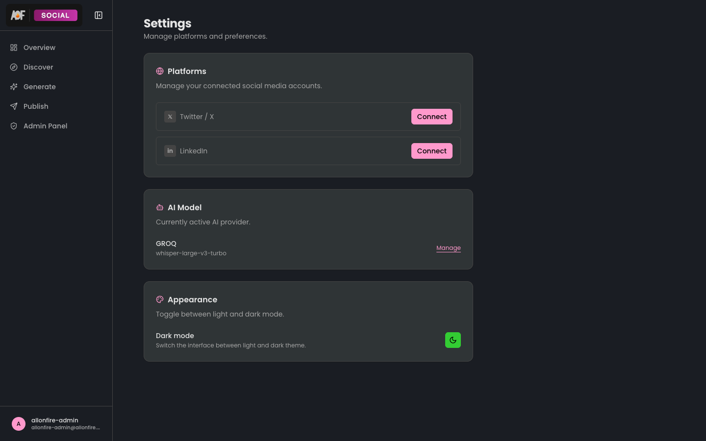
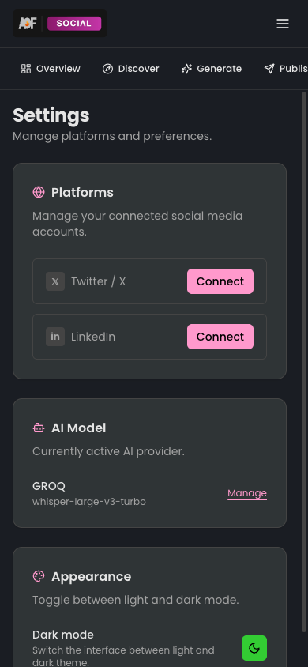

<h1 align="center">Settings</h1>

<p align="center">
  Manage platform connections, AI model, and appearance preferences.
</p>

---

<p align="center">
  
  &nbsp;&nbsp;
  
</p>

## 📁 Structure

```
settings/
  actions/
    (empty — reuses publish feature's actions)
  components/
    connected-platforms.tsx   Platform connection management
```

## ✨ What it Does

The settings page has three sections rendered in the page file:

| Section | Description | Source |
|---------|-------------|--------|
| 🌐 Platforms | Connect/disconnect Twitter and LinkedIn via OAuth | `ConnectedPlatforms` component |
| 🤖 AI Model | Shows active provider + model, links to admin | Page-level (not in feature) |
| 🎨 Appearance | Dark/light theme toggle | Page-level (not in feature) |

### ConnectedPlatforms Component

Iterates through `platformEnum.options` and renders a `PlatformConnect` component (imported from the publish feature) for each platform. Fetches account data via `getConnectedAccountsAction()` and handles connect/disconnect callbacks to refresh the list.

## 🔗 Reused from Publish Feature

This feature intentionally reuses OAuth components and actions from [`publish`](../publish/):
- `PlatformConnect` — OAuth popup UI
- `getConnectedAccountsAction` — Fetch connected accounts
- `disconnectAccountAction` — Remove connection
- `platformEnum` — Platform validation
