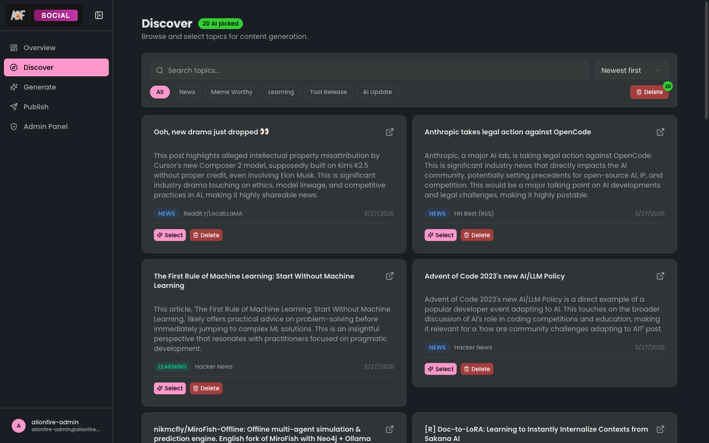
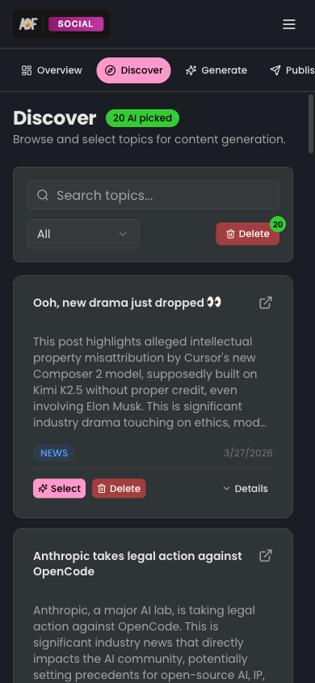

<h1 align="center">Topics</h1>

<p align="center">
  
  
  
</p>

<p align="center">
  Discover and manage content topics sourced from 9 external feeds. Topics are categorized, filterable, and presented in an infinite-scroll grid with animated transitions.
</p>

## 📸 Screenshots

<p align="center">
  
  &nbsp;&nbsp;
  
</p>

## 📁 Directory Structure

```
topics/
  actions/
    topics.ts                         Select and delete topics
  components/
    delete-all-dialog.tsx             Bulk delete confirmation dialog
    delete-topic-dialog.tsx           Single topic delete confirmation
    discover-client.tsx               Main discover page orchestrator
    discover-filters.tsx              Category pills, search bar, sort controls
    topic-card.tsx                    Individual topic card with metadata
    topic-card-discover-actions.tsx   Select/delete action buttons per card
    topic-card-skeleton.tsx           Loading placeholder skeleton
    topic-list.tsx                    Paginated grid with infinite scroll
    topic-utils.ts                   Category color mapping and formatting helpers
  hooks/
    use-debounced-search.ts           300ms debounced search input
    use-infinite-scroll.ts            Intersection Observer-based pagination trigger
    use-topics-paginated.ts           TanStack Query infinite query for topic pages
  types/
    topic-types.ts                    TopicWithPrompts, PaginatedTopicResult
```

## :sparkles: Key Capabilities

- **6 categories** — News, Meme Worthy, Learning, Tool Release, AI Update, and general
- **Infinite scroll** — Intersection Observer triggers next page fetch via TanStack Query
- **9 content sources** — Topics are aggregated from multiple external feeds
- **Debounced search** — 300ms delay prevents excessive API calls while typing
- **Animated transitions** — Framer Motion handles card enter/exit and layout shifts

## :arrows_counterclockwise: Data Flow

```
DiscoverClient (orchestrator)
  DiscoverFilters (category pills, search, sort)
    useDebouncedSearch (300ms)
  TopicList (infinite grid)
    useTopicsPaginated (TanStack Query useInfiniteQuery)
    useInfiniteScroll (Intersection Observer)
    TopicCard
      TopicCardDiscoverActions (select / delete)
    TopicCardSkeleton (loading state)
  DeleteTopicDialog / DeleteAllDialog (confirmation modals)
```

## :link: Import Pattern

```ts
import { DiscoverClient } from "@/features/topics/components/discover-client";
import { TopicCard } from "@/features/topics/components/topic-card";
import type { TopicWithPrompts } from "@/features/topics/types/topic-types";
```

No barrel `index.ts` files — always import directly from the specific file.
